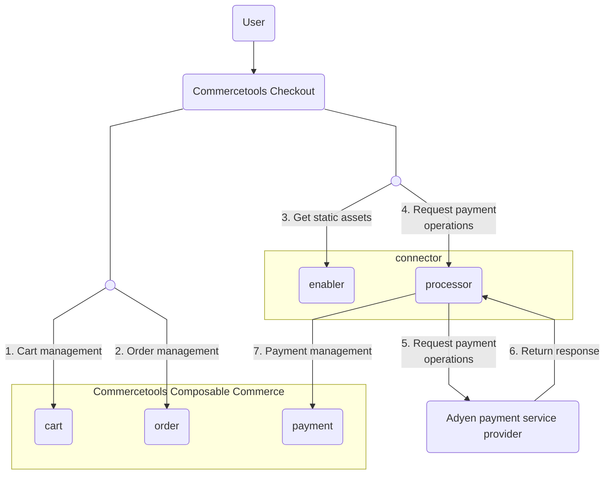

# connect-payment-integration-adyen
This repository provides a [connect](https://docs.commercetools.com/connect) for integration to Adyen payment service provider (PSP).

## Features
- Typescript language supported.
- Uses Fastify as web server framework.
- Uses [commercetools SDK](https://docs.commercetools.com/sdk/js-sdk-getting-started) for the commercetools-specific communication.
- Uses [connect payment SDK](https://github.com/commercetools/connect-payments-sdk) to manage request context, sessions and JWT authentication.
- Includes local development utilities in npm commands to build, start, test, lint & prettify code.

## Overview
The adyen-integration connector contains two modules :  
- Enabler: Acts as a wrapper implementation in which frontend components from Adyen embedded. It gives control to checkout product on when and how to load the connector frontend based on business configuration. In cases connector is used directly and not through Checkout product, the connector library can be loaded directly on frontend than the PSP one.
- Processor : Acts as backend services which is middleware to integrate with Adyen platform. It is mainly responsible for managing transactions with Adyen and updating payment entity in composable commerce.  `connect-payment-sdk` will be offered to be used in connector to manage request context, sessions and other tools necessary to transact.



1. commercetools Checkout in front-end side sends requests to composable commerce for cart creation.
2. commercetools Checkout retrieves SDK as static assets from enabler in connector.
3. After downloading the SDK, commercetools Checkout sends request via the SDK to endpoints exposed by processor for various payment operations.
4. The processor transforms the received request and send them to Ayden platform.
5. Adyen processes the payment operations and return the response to processor.
6. The processor handles the payment persistence to composable commerce, and return the result to front-end.
7. commercetools Checkout handles the order management in composable commerce once it receives the result from the processor. 

## Prerequisite
#### 1. commercetools composable commerce API client
Users are expected to create API client responsible for payment management in composable commerce project. Details of the API client are taken as input as environment variables/ configuration for connect such as `CTP_PROJECT_KEY` , `CTP_CLIENT_ID`, `CTP_CLIENT_SECRET`. For details, please read [Deployment Configuration](./README.md#deployment-configuration).
In addition, please make sure the API client should have enough scope to be able to manage payment. For details, please refer to [Running Application](./processor/README.md#running-application)

#### 2. various URLs from commercetools composable commerce
Various URLs from commercetools platform are required to be configured so that the connect application can handle session and authentication process for endpoints.
Their values are taken as input as environment variables/ configuration for connect with variable names `CTP_API_URL`, `CTP_AUTH_URL` and `CTP_SESSION_URL`.

#### 3. Adyen account credentials
Various account data provided by Adyen are necessary to be configured so that the requests from the connect application can be authenticated by Adyen platform within the integration.
Their values are taken as input as environment variables/ configuration for connect with variable names `ADYEN_API_KEY`, `ADYEN_NOTIFICATION_HMAC_KEY`, `ADYEN_MERCHANT_ACCOUNT`, `ADYEN_CLIENT_KEY`, `ADYEN_LIVE_URL_PREFIX` and `ADYEN_ENVIRONMENT`.

## Development Guide
Regarding the development of enabler module, please refer to the following documentations:
- [Development of Enabler](./enabler/README.md)

Regarding the development of processor module, please refer to the following documentations:
- [Development of Processor](./processor/README.md)

#### Connector in commercetools Connect
Use public connector listed in connect marketplace. If any customization done, follow guidelines [here](https://docs.commercetools.com/connect/getting-started) to register the connector for private use.

#### Deployment Configuration
In order to deploy your customized connector application on commercetools Connect, it needs to be published. For details, please refer to [documentation about commercetools Connect](https://docs.commercetools.com/connect/concepts)
In addition, in order to support connect, the adyen payment integration connector has a folder structure as listed below
```
├── enabler
│   ├── src
│   ├── test
│   └── package.json
├── processor
│   ├── src
│   ├── test
│   └── package.json
└── connect.yaml
```

Connect deployment configuration is specified in `connect.yaml` which is required information needed for publishing of the application. Following is the deployment configuration used by enabler and processor modules
```
deployAs:
  - name: enabler
    applicationType: assets
  - name: processor
    applicationType: service
    endpoint: /
    configuration:
      standardConfiguration:
        - key: CTP_PROJECT_KEY
          description: commercetools project key
          required: true
        - key: CTP_AUTH_URL
          description: commercetools Auth URL
          required: true
          default: https://auth.europe-west1.gcp.commercetools.com
        - key: CTP_API_URL
          description: commercetools API URL
          required: true
          default: https://api.europe-west1.gcp.commercetools.com
        - key: CTP_SESSION_URL
          description: Session API URL
          required: true
          default: https://session.europe-west1.gcp.commercetools.com
        - key: CTP_CLIENT_ID
          description: commercetools client ID with manage_payments, manage_orders, view_sessions, view_api_clients, manage_checkout_payment_intents & introspect_oauth_tokens scopes
          required: true
        - key: ADYEN_ENVIRONMENT
          description: Adyen environment
          required: true
          default: TEST
        - key: ADYEN_MERCHANT_ACCOUNT
          description: Adyen merchant account
          required: true
        - key: ADYEN_CLIENT_KEY
          description: Adyen client key
          required: true
        - key: ADYEN_LIVE_URL_PREFIX
          description: Adyen live URL prefix
        - key: MERCHANT_RETURN_URL
          description: Merchant return URL
          required: true
        - key: CTP_JWKS_URL
          description: JWKs url (example - https://mc-api.europe-west1.gcp.commercetools.com/.well-known/jwks.json)
          required: true
          default: https://mc-api.europe-west1.gcp.commercetools.com/.well-known/jwks.json
        - key: CTP_JWT_ISSUER
          description: JWT Issuer for jwt validation (example - https://mc-api.europe-west1.gcp.commercetools.com)
          required: true
          default: https://mc-api.europe-west1.gcp.commercetools.com
        - key: ADYEN_APPLEPAY_OWN_MERCHANT_ID
          description: Apple merchant ID. Needed when using own certificate
          required: false
        - key: ADYEN_APPLEPAY_OWN_MERCHANT_DOMAIN
          description: Apple merchant domain. Needed when using own certificate
          required: false
        - key: ADYEN_APPLEPAY_OWN_DISPLAY_NAME
          description: Apple display name. Needed when using own certificate
          required: false
        - key: ADYEN_SHOPPER_STATEMENT
          description: The text to be shown on the shopper's bank statement. We recommend sending a maximum of 22 characters, otherwise banks might truncate the string
          required: false
      securedConfiguration:
        - key: CTP_CLIENT_SECRET
          description: commercetools client secret
          required: true
        - key: ADYEN_API_KEY
          description: Adyen API key
          required: true
        - key: ADYEN_NOTIFICATION_HMAC_KEY
          description: Adyen HMAC key
          required: true
        - key: ADYEN_APPLEPAY_OWN_CERTIFICATE
          description: Apple Pay own certificate
          required: false

```

Here you can see the details about various variables in configuration
- `CTP_PROJECT_KEY`: The key of commercetools composable commerce project.
- `CTP_CLIENT_ID`: The client ID of your commercetools composable commerce user account. It is used in commercetools client to communicate with commercetools composable commerce via SDK. Expected scopes are: `manage_payments` `manage_orders` `view_sessions` `view_api_clients` `manage_checkout_payment_intents` `introspect_oauth_tokens`.
- `CTP_CLIENT_SECRET`: The client secret of commercetools composable commerce user account. It is used in commercetools client to communicate with commercetools composable commerce via SDK.
- `CTP_AUTH_URL`: The URL for authentication in commercetools platform. It is used to generate OAuth 2.0 token which is required in every API call to commercetools composable commerce. The default value is `https://auth.europe-west1.gcp.commercetools.com`. For details, please refer to documentation [here](https://docs.commercetools.com/tutorials/api-tutorial#authentication).
- `CTP_API_URL`: The URL for commercetools composable commerce API. Default value is `https://api.europe-west1.gcp.commercetools.com`.
- `CTP_SESSION_URL`: The URL for session creation in commercetools platform. Connectors relies on the session created to be able to share information between enabler and processor. The default value is `https://session.europe-west1.gcp.commercetools.com`.
- `CTP_JWKS_URL`: The URL which provides JSON Web Key Set. Default value is `https://mc-api.europe-west1.gcp.commercetools.com/.well-known/jwks.json`.
- `CTP_JWT_ISSUER`: The issuer inside JSON Web Token which is required in JWT validation process. Default value is `default: https://mc-api.europe-west1.gcp.commercetools.com`
- `ADYEN_ENVIRONMENT`: The indicator of adyen environment.  Default value is `TEST`. It can be configured either as `LIVE` or `TEST`.
- `ADYEN_MERCHANT_ACCOUNT`: The name of adyen merchant account.
- `ADYEN_CLIENT_KEY`: Client key provided by Adyen for client-side authentication. For details, please refer to [Adyen client-side authentication](https://docs.adyen.com/development-resources/client-side-authentication).
- `ADYEN_LIVE_URL_PREFIX`: It represents live endpoint prefix used by Adyen platform. It is only required for Adyen live environment. For details, please refer to [Adyen live endpoints](https://docs.adyen.com/development-resources/live-endpoints/).
- `MERCHANT_RETURN_URL`: The return URL located in merchant platform.
- `ADYEN_API_KEY`: It represents the API Key used for Ayden request authentication. For details, please refer to [Ayden API key authentication](https://docs.adyen.com/development-resources/api-authentication/#api-key-authentication).
- `ADYEN_NOTIFICATION_HMAC_KEY`: It represents a hash-based signature within Ayden webhook event. It aims at protecting the connector from any unauthorized webhook event. For details, please refer to [Verify HMAC signatures](https://docs.adyen.com/development-resources/webhooks/verify-hmac-signatures).
- `ADYEN_APPLEPAY_OWN_CERTIFICATE`: The merchant identity certificate. This is only needed if using an own certificate instead of the Adyen's Apple Pay certificate. Follow [Adyen's guide](https://docs.adyen.com/payment-methods/apple-pay/enable-apple-pay/?tab=setup-own_2) to create the certificate. **The value should be in base64 format**.
- `ADYEN_APPLEPAY_OWN_MERCHANT_ID`: The merchant identifier created in the Apple portal. Only needed if using an own certificate
- `ADYEN_APPLEPAY_OWN_MERCHANT_DOMAIN`: The merchant domain verified in the Apple portal. Only needed if using an own certificate. Do not add the https protocol.
- `ADYEN_APPLEPAY_OWN_DISPLAY_NAME`: A string of 64 or fewer UTF-8 characters containing the canonical name for your store, suitable for display. This needs to remain a consistent value for the store and shouldn’t contain dynamic values such as incrementing order numbers. Only needed if using an own certificate.
- `ADYEN_SHOPPER_STATEMENT`: The text to be shown on the shopper's bank statement. For more information, see [Adyen's reference](https://docs.adyen.com/api-explorer/Checkout/71/post/payments#request-shopperStatement).

## Development
In order to get started developing this connector certain configuration are necessary, most of which involve updating environment variables in both services (enabler, processor).

#### Configuration steps

#### 1. Environment Variable Setup

Navigate to each service directory and duplicate the .env.template file, renaming the copy to .env. Populate the newly created .env file with the appropriate values.

```bash
cp .env.template .env
```

#### 2. Spin Up Components via Docker Compose
With the help of docker compose, you are able to spin up all necessary components required for developing the connector by running the following command from the root directory;

```bash
docker compose up
```

This command would start 3 required services, necessary for development
1. JWT Server
2. Enabler
3. Processor
